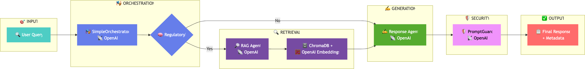

# RAG Nakamo - Regulatory Intelligence System

A RAG (Retrieval-Augmented Generation) system specialized for medical device regulatory documents, with intelligent orchestration and security features.

**V2.1 UPGRADE**  
 - Improved pythonic modular separations : agents/security/data/vectorstore/settings/scripts
 - Added new logging viewer for constant monitoring
 - Changed prompt guarding strategy, for robust prompt security
 - optimized RAG, change from chunking strategy + retrieval evaluations
 - prepare for extension, new agents or LLMS
 - smart orchestrator sample, to replace old sequential workflow
 - see [NOTES](./NOTES.md) for more detailed steps of improvements
 - german language [report](./report/report_DEU.md)

<div align="center">
  
</div>

___

## Features

- 🎭 **Smart Orchestrator**: Actually decide whether to use RAG based on query type
- 📚 **Document Search**: Vector-based search across FDA and WHO regulatory documents  
- 🛡️ **Security Guard**: Validates and secures responses before delivery
- 🔄 **Multi-agent architecture**: Specialized agents for orchestrating tasks, retrieving data, generating responses, and validating outputs
- **ChromaDB**: Efficient database querying for relevant information
- **Integration with external APIs**: Uses standard OpenAI and Google APIs for advanced processing and search capabilities
- **LLM flexibility**: OpenAI, Huggingface, Ollama support
- ⚡ **Performance Tracking**: Built-in timing and logging for all operations

**demo runs .mp4**
See [demo1](./demos/main2_compressed.mp4) and [demo2](./demos/main_compressed.mp4). 

**Tech report**
Available in [german](./report)

## Quick Start

### Prerequisites

- Python 3.10+
- Conda (recommended)
- OpenAI API key

### Installation with conda

1. **Clone the repository and activate conda**
   ```bash
   git clone <your-repo-url>
   cd rag_nakamo
   conda create -n rags python=3.10
   conda activate rags
   pip install -r requirements.txt
   ```

2. **Set up environment variables**
   
   Create a `.env` file in the `src/` directory (this file should NEVER be committed to git):
   ```bash
   cd src/
   cp .env.example .env 
   ```

   Edit the `.env` file and add your OpenAI API key:
   ```env
   OPENAI_API_KEY=sk-your-openai-api-key-here
   ```

3. **Prepare document database**

   Place your regulatory documents (PDFs) in the `src/data/` directory, then run:
   ```bash
   cd src/
   python3 rag_nakamo/vectorstore/ingestion.py
   ```
   This will create a src/chroma_db vector store, used by the RAG agent. 

#### Getting Your OpenAI API Key

1. Go to [OpenAI's website](https://platform.openai.com/)
2. Sign up or log in to your account
3. Navigate to the API keys section
4. Create a new API key
5. Copy the key and paste it in your `.env` file

## Usage

The system provides two main entry points:

### 1. Original Implementation (main.py)
Traditional sequential execution: Orchestrator → RAG → Response → Security Guard

```bash
cd src/
python main.py
```

### 2. Smart Orchestrator (main2_1.py) - **RECOMMENDED**
Intelligent workflow with decision-making: Query Analysis → Conditional RAG → Response → Conditional Security

```bash
cd src/
python main2_1.py
```

### 3. Coming up : **UI** and model choice (unprioritized)

### Example Queries

**Regulatory queries** (will use RAG):
- "What are FDA software validation requirements?"
- "How do medical device regulations work?"
- "Compare FDA and WHO design control processes"

**Non-regulatory queries** (will skip RAG):
- "What is the weather today?"
- "How do I cook pasta?"


## Project Structure

```
rag_nakamo/
├── src/
│   ├── rag_nakamo/              # Main package
│   │   ├── agents/              # Agent implementations
│   │   │   ├── orchestrator.py  # Original orchestrator
│   │   │   ├── new_orch.py      # Smart orchestrator (v2.1)
│   │   │   ├── rag.py           # RAG agent
│   │   │   └── response.py      # Response agent
│   │   ├── security/            # Security components
│   │   │   ├── prompt_guard.py  # Response validation
│   │   │   └── schemas.py       # Security schemas
│   │   ├── vectorstore/         # Vector database
│   │   │   └── chroma_manager.py
│   │   ├── settings.py          # Configuration
│   │   └── logger_config.py     # Logging setup
│   ├── data/                    # Your PDF documents
│   ├── chroma_db/               # Vector database (auto-created)
│   ├── main.py                  # Original implementation
│   ├── main2_1.py               # Smart orchestrator demo
│   └── .env                     # Your API keys (DO NOT COMMIT)
└── README.md
```

__
## Additional info
### Configuration

The system is configured via `src/rag_nakamo/settings.py`. Key settings:

- `orchestrator_model`: Model for orchestration decisions (default: gpt-4o-mini)
- `response_model`: Model for response generation (default: gpt-4o-mini)
- `retrieval_top_k`: Number of documents to retrieve (default: 5)
- `enable_rerank`: Whether to rerank search results (default: False)

### Security Features

The system includes a security layer that:

1. **Validates prompts** for harmful content
2. **Checks responses** for compliance and safety  
3. **Makes decisions** to allow, block, or sanitize content
4. **Provides explanations** for security decisions

### Development

#### Adding New Agents

1. Inherit from `BaseAgent` in `rag_nakamo/agents/base.py`
2. Implement `process_message()` method
3. Register with the orchestrator using `register_agent()`

### Version History

- **v2.1**: Smart Orchestrator with decision-making capabilities
- **v2.0**: Completely rewriten Agents. Security integration with PromptGuard
- **v1.0**: Basic RAG system with sequential agents
<!-- 5. **Perform a web search** for additional information using Google Search. -->