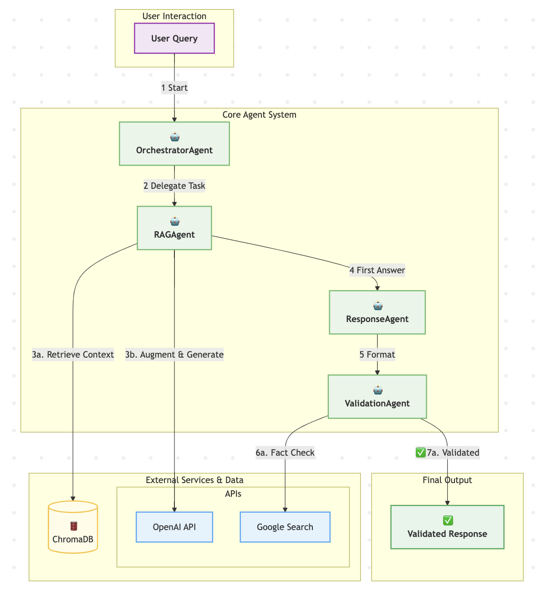

# RAG Nakamo

- **Multi-agent architecture**:  Specialized agents for orchestrating tasks, retrieving data, generating responses, and validating outputs.
- **ChromaDB**: Efficient database querying for relevant information.
- **Integration with external APIs**: Uses stander OpenAI and Google APIs for advanced processing and search capabilities.
- **LLM flexibility**: OpenAI, Hugginface, Ollama. 
- **Agent Tests**

<div align="center">
  
</div>


## Overview
Python-based application designed to process queries related to medical device regulations. It leverages multiple agents to generate, validate, and enhance responses using external APIs and databases. The application is structured to perform the following steps:

1. **Generate an action plan** using the `OrchestratorAgent`.
2. **Process the action plan** and query a database using the `RAGAgent`.
3. **Generate a response** using the `ResponseAgent`.
4. **Validate the response** using the `ValidationAgent`.
5. **Perform a web search** for additional information using Google Search.


## Installation

1. Install dependencies:
    ```bash
    pip install -r requirements.txt
     ```
2. Set up API keys:
   - Add your OpenAI API key to `openai_api_key.txt`.
   - Add your Google API key and CX to `google_config.txt` (one per line).

## Usage

Command line:
1. Run the main script (Enter query or modify the default query in `main.py`)
    ```bash
    python main.py
    ```
2. Run the web app
    ```bash
    streamlit run app.py
    ```

## File Structure

- `main.py`: Main script for running the whole workflow.
- `orchestrator.py`: Contains the `OrchestratorAgent` class for generating action plans.
- `rag.py`: Implements the `RAGAgent` class for database querying.
- `response.py`: Defines the `ResponseAgent` class for generating responses.
- `validation.py`: Includes the `ValidationAgent` class for validating responses.
- `web_search.py`: Provides Google Search integration (experimental).
- `chroma_db/`: Contains the ChromaDB database files.
- `tests/`: Includes test scripts for various components.

## Testing

Run the *_test* scripts to validate the functionality of individual components (requires the API setup)


## Main inspiration and notes

Using function calling for the orchestrator :  
https://huggingface.co/docs/hugs/guides/function-calling  
Allows the orchestrator LLM to actually choose.  

Create chat completion  
https://platform.openai.com/docs/api-reference/chat/create  
Currently being replaced by Responses.  

Rag:
Chroma, parsing and sorting. 
https://www.datacamp.com/tutorial/chromadb-tutorial-step-by-step-guide. 

<!-- Focus areas from orchestrator used to format. Need good explanation on params of available functions.  -->


Web search : 
Google cloud console 
https://developers.google.com/custom-search/v1/overview
Search engine : https://programmablesearchengine.google.com/controlpanel/create

### My todos
 - [x]ingests (+ vector store manager and chromaDB)
 - [x]orchestrator
 - [x]rag
 - [x]summary
 - [x]webtool (added after workflow)
 - [x]validation agent
 - [x]hf model (orchestrator+response+val)
 - [x]ollama model (orchestrator+response+val)
 - [x]UI choice
 - [ ]speed tests
 - [ ]lawyer agent?
 - [ ]country agent?

## UPGRADE
Given genereal dissatisfaction and previous lack of time for the project, I want to improve several things : 

 - Improve modular separations : agents/tools/data/storage/interface
 - Add logging viewer for constant monitoring
 - Change testing strategy, have a serious one
 - Continuous integration and vulnerability tests  
 - optimize RAG, change from chunking strategy + retrieval evaluations
 - prepare for extension, new agents or LLMS
 - strengthen security (research TODO)